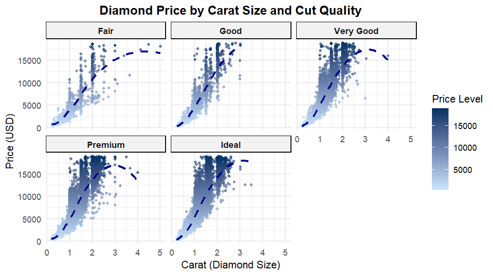

# Introduction
The diamonds dataset provides a detailed look at the attributes influencing diamond pricing, including carat, cut, color, clarity, and price. This repository explores these features to uncover patterns and relationships.

# Implementation
Using R and the ggplot2 package, we analyzed the relationship between carat size and price, grouped by cut quality. Visualizations included scatter plots with trend lines to highlight key trends.

# Results
Diamond prices generally increase with carat size, with trends varying across cut qualities. Higher-quality cuts like Premium and Ideal showed smoother price trends, while Fair cuts exhibited more variability.
 
 
# Contact
If you have any questions, feel free to contact me at:
- Email: ltt5089@.edu
